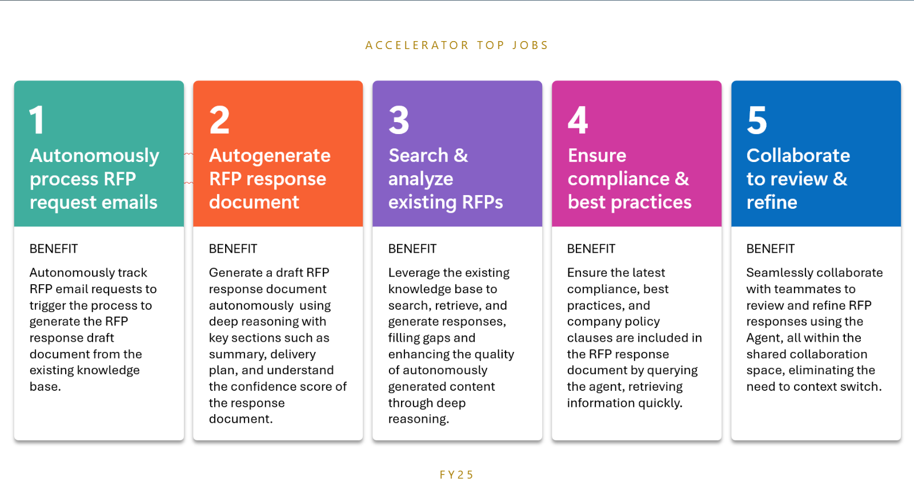
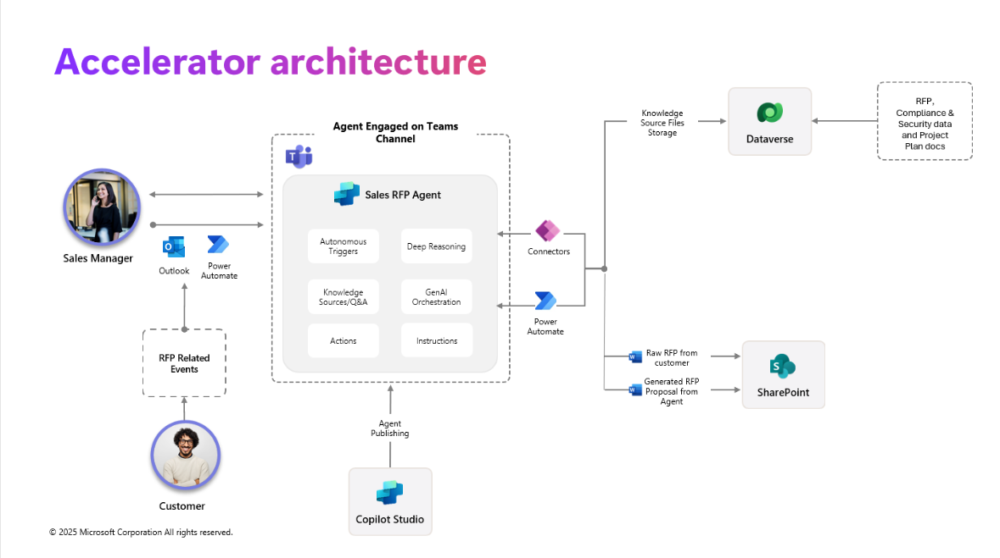

# Agent for RFP Response

MENU: [**USER STORY**](#user-story) \| [**QUICK DEPLOY**](#quick-deploy) \| [**SUPPORTING DOCUMENTS**](#supporting-documents)

  

# User Story

## Solution Overview

The Agent for RFP response processes RFP documents and leverages its knowledge base to create a draft proposal posted autonomously in Microsoft Teams.

This includes a proposal summary, project plan, compliance & security considerations and a confidence score harnessing the capabilities of deep reasoning, autonomous triggers, generative ai orchestration, knowledge sources and workflow automation.

Leveraging Copilot Studio, Power Platform, Microsoft Teams and SharePoint users are able to get a draft proposal in response to the RFP received by customers in Microsoft Teams autonomously by the agent with no input needed. This multiplies user productivity, reduces RFP response time,

**Note:** This accelerator is not intended to be a production ready solution. The components can be extended through customization and configuration as desired to create a production ready solution. All components packaged have been done through an unmanaged solution, which allows users to be able to customize and extend the components post-deployment.

## Key features

This accelerator focuses on harnessing the following key capabilities:

* [Deep Reasoning in Copilot Studio](https://www.youtube.com/watch?v=_v9ri9eoVFg)
* [Autonomous triggers in Copilot Studio](https://learn.microsoft.com/en-us/microsoft-copilot-studio/authoring-triggers-about)
* [Generative AI Orchestration in Copilot Studio](https://learn.microsoft.com/en-us/microsoft-copilot-studio/faqs-generative-orchestration)
* [Knowledge Sources in Copilot Studio](https://learn.microsoft.com/en-us/microsoft-copilot-studio/knowledge-copilot-studio)
* [User intent detection in Copilot Studio](https://learn.microsoft.com/en-us/microsoft-copilot-studio/guidance/cux-identify-intents)
* [Adaptive Cards in Copilot Studio](https://learn.microsoft.com/en-us/microsoft-copilot-studio/guidance/adaptive-cards-overview)
* [Publishing Copilot agent in Microsoft Teams](https://learn.microsoft.com/en-us/microsoft-copilot-studio/publication-add-bot-to-microsoft-teams)
* [Using SharePoint library for document storage](https://support.microsoft.com/en-us/office/create-a-document-library-in-sharepoint-306728fe-0325-4b28-b60d-f902e1d75939)

Below is a sample landing page of the solution accelerator after it is deployed, set up, and ready to be used:

## Scenario

An organization recieves a RFP (request for proposal) document from a customer via email. This acts as the **autonomous trigger** for the RFP response agent to start creating a proposal for the recieved RFP. 

The agent starts this process by-

1. **Identifying the product** the customer is enquiring about from the email.
2. Once that's done, **using deep reasoning and generative AI orchestration**, the agent leverags it's **existing knowledge base of RFP's** submitted in the past to create a proposal including product specifications & services the organization offers.
3. The agent proceeds from here to create a section for compliance & security based on best practices from the org
4. Create a section for a high level project plan on how the identified products & services will be delivered.
5. Gives a confidence score on the accuracy of the content.
6. Finally, the agent posts the draft proposal as an adaptive card in MS Teams in a deal room channel to meet the sellers in their system of productivity. From here, the users can collaborate on the document and finalize it for submission.

This agent reduces RFP completion time, enhances user productivity by already creating a version of the proposal by leveraging existing knowledge base and empowers the sellers to focus on the more challenging aspects of the RFP rather than spending time creating a document on content the organization already has access too.

  

# Quick Deploy

Please click this [**Link to Deployment Guide**](Deployment/README.md) for instructions on how to deploy and set up the solution accelerator.

[**Usage Guidance**](Deployment/USAGE_GUIDANCE.md) has been provided to assist you in executing the steps required to see the included capabilities of this accelerator in action..

## Solution Accelerator Architecture

  

# Supporting Documents

## How to customize

This solution is designed to be easily customizable. All configuration and customizations to this solution will be done in Power Platform and Copilot Studio.

## Additional resources

1. [Microsoft Power Platform](https://learn.microsoft.com/en-us/power-platform/)
2. [Microsoft Copilot Studio](https://learn.microsoft.com/en-us/microsoft-copilot-studio/)

# Disclaimers

This release only supports English language input and output. Users should not attempt to use the system with any other language or format. The system output may not be compatible with any translation tools or services, and may lose its meaning or coherence if translated.

This release does not reflect the opinions, views, or values of Microsoft Corporation or any of its affiliates, subsidiaries, or partners. The system output is solely based on the system's own logic and algorithms, and does not represent any endorsement, recommendation, or advice from Microsoft or any other entity. Microsoft disclaims any liability or responsibility for any damages, losses, or harms arising from the use of this release or its output by any user or third party.

This release is intended as a proof of concept only, and is not a finished or polished product. It is not intended for commercial use or distribution, and is subject to change or discontinuation without notice. Any planned deployment of this release or its output should include comprehensive testing and evaluation to ensure it is fit for purpose and meets the user's requirements and expectations. Microsoft does not guarantee the quality, performance, reliability, or availability of this release or its output, and does not provide any warranty or support for it.

This Software requires the use of third-party components which are governed by separate proprietary or open-source licenses as identified below, and you must comply with the terms of each applicable license in order to use the Software. You acknowledge and agree that this license does not grant you a license or other right to use any such third-party proprietary or open-source components.

To the extent that the Software includes components or code used in or derived from Microsoft products or services, including without limitation Microsoft Azure Services (collectively, “Microsoft Products and Services”), you must also comply with the Product Terms applicable to such Microsoft Products and Services. You acknowledge and agree that the license governing the Software does not grant you a license or other right to use Microsoft Products and Services. Nothing in the license or this ReadMe file will serve to supersede, amend, terminate or modify any terms in the Product Terms for any Microsoft Products and Services.

You must also comply with all domestic and international export laws and regulations that apply to the Software, which include restrictions on destinations, end users, and end use. For further information on export restrictions, visit [https://aka.ms/exporting](https://aka.ms/exporting).

You acknowledge that the Software and Microsoft Products and Services (1) are not designed, intended or made available as a medical device(s), and (2) are not designed or intended to be a substitute for professional medical advice, diagnosis, treatment, or judgment and should not be used to replace or as a substitute for professional medical advice, diagnosis, treatment, or judgment. Customer is solely responsible for displaying and/or obtaining appropriate consents, warnings, disclaimers, and acknowledgements to end users of Customer’s implementation of the Online Services.

You acknowledge the Software is not subject to SOC 1 and SOC 2 compliance audits. No Microsoft technology, nor any of its component technologies, including the Software, is intended or made available as a substitute for the professional advice, opinion, or judgement of a certified financial services professional. Do not use the Software to replace, substitute, or provide professional financial advice or judgment.

BY ACCESSING OR USING THE SOFTWARE, YOU ACKNOWLEDGE THAT THE SOFTWARE IS NOT DESIGNED OR INTENDED TO SUPPORT ANY USE IN WHICH A SERVICE INTERRUPTION, DEFECT, ERROR, OR OTHER FAILURE OF THE SOFTWARE COULD RESULT IN THE DEATH OR SERIOUS BODILY INJURY OF ANY PERSON OR IN PHYSICAL OR ENVIRONMENTAL DAMAGE (COLLECTIVELY, “HIGH-RISK USE”), AND THAT YOU WILL ENSURE THAT, IN THE EVENT OF ANY INTERRUPTION, DEFECT, ERROR, OR OTHER FAILURE OF THE SOFTWARE, THE SAFETY OF PEOPLE, PROPERTY, AND THE ENVIRONMENT ARE NOT REDUCED BELOW A LEVEL THAT IS REASONABLY, APPROPRIATE, AND LEGAL, WHETHER IN GENERAL OR IN A SPECIFIC INDUSTRY. BY ACCESSING THE SOFTWARE, YOU FURTHER ACKNOWLEDGE THAT YOUR HIGH-RISK USE OF THE SOFTWARE IS AT YOUR OWN RISK.
