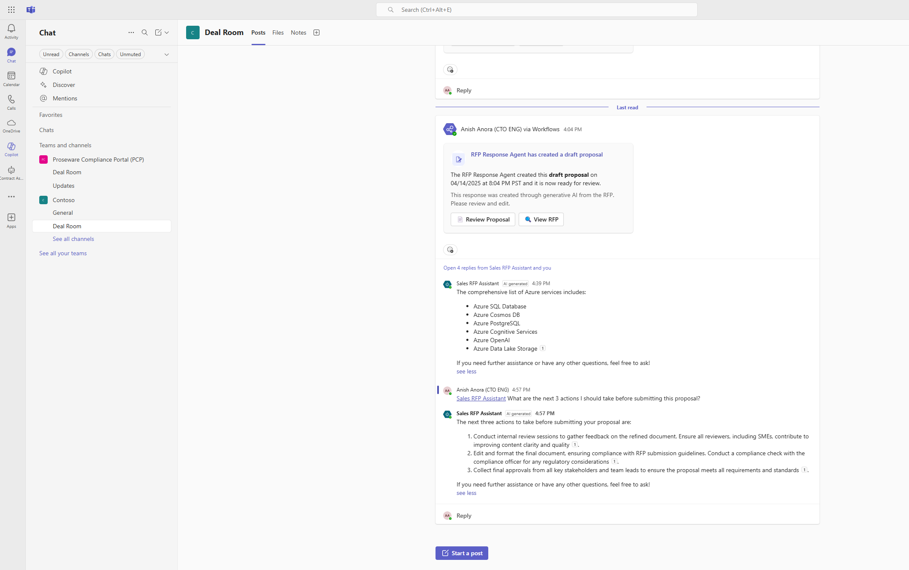

# Agent for RFP Response

AI Agent that helps employees summarize, analyze, and generate high quality Request for Proposal (RFP) responses, saving time and streamlining RFP completion workflows. The AI Agent intelligently processes RFP requests by parsing emails, summarizing, analyze, and generating high quality draft RFP response documents, saving employees time and streamlining RFP completion workflows.

These capabilities can be applied to numerous other use cases including: create draft legal documents, create claim processing responses, create responses for customer or vendor inquiries, as long as there is good quality knowledge base that AI agent can utilize. 

 

[**SOLUTION OVERVIEW**](#solution-overview)  \| [**QUICK DEPLOY**](#quick-deploy)  \| [**BUSINESS USE CASE**](#business-use-case)  \| [**SUPPORTING DOCUMENTATION**](#supporting-documentation)

 

<h2>
Solution overview
</h2>

The Agent for RFP response processes RFP documents and leverages its knowledge base to create a draft proposal posted autonomously in Microsoft Teams.

This includes a proposal summary, project plan, compliance & security considerations and a confidence score harnessing the capabilities of deep reasoning, autonomous triggers, generative ai orchestration, knowledge sources and workflow automation.

Leveraging Copilot Studio, Power Platform, Microsoft Teams and SharePoint users are able to get a draft proposal in response to the RFP received by customers in Microsoft Teams autonomously by the agent with no input needed. This multiplies user productivity, reduces RFP response time,

**Note:** This accelerator is not intended to be a production ready solution. The components can be extended through customization and configuration as desired to create a production ready solution. All components packaged have been done through an unmanaged solution, which allows users to be able to customize and extend the components post-deployment.

### Solution architecture

Solution Architecture is illustrated below. Please refer to [Differentiators](./Deployment/DIFFERENTIATORS.md) and [Demo Script](./Deployment/DEMO_SCRIPT.md) for additional information. 

|  |
| ------------------------------------------------------- |
|                                                         |

### How to customize
This solution is designed to be easily customizable. All configuration and customizations to this solution will be done in Power Platform and Copilot Studio.

 

### Additional resources

This accelerator utilizes below key products: 

* [Microsoft Power Platform](https://learn.microsoft.com/en-us/power-platform/)
* [Microsoft Copilot Studio](https://learn.microsoft.com/en-us/microsoft-copilot-studio/)
* [Microsoft SharePoint](https://www.microsoft.com/en-us/microsoft-365/sharepoint/collaboration)
* [Microsoft Teams](https://www.microsoft.com/en-us/microsoft-teams/group-chat-software)

This accelerator focuses on harnessing the following key capabilities:

* [Deep Reasoning in Copilot Studio](https://www.youtube.com/watch?v=_v9ri9eoVFg)
* [Autonomous triggers in Copilot Studio](https://learn.microsoft.com/en-us/microsoft-copilot-studio/authoring-triggers-about)
* [Generative AI Orchestration in Copilot Studio](https://learn.microsoft.com/en-us/microsoft-copilot-studio/faqs-generative-orchestration)
* [Knowledge Sources in Copilot Studio](https://learn.microsoft.com/en-us/microsoft-copilot-studio/knowledge-copilot-studio)
* [User intent detection in Copilot Studio](https://learn.microsoft.com/en-us/microsoft-copilot-studio/guidance/cux-identify-intents)
* [Adaptive Cards in Copilot Studio](https://learn.microsoft.com/en-us/microsoft-copilot-studio/guidance/adaptive-cards-overview)
* [Publishing Copilot agent in Microsoft Teams](https://learn.microsoft.com/en-us/microsoft-copilot-studio/publication-add-bot-to-microsoft-teams)
* [Using SharePoint library for document storage](https://support.microsoft.com/en-us/office/create-a-document-library-in-sharepoint-306728fe-0325-4b28-b60d-f902e1d75939)

 

### Key features

  
Click to learn more about the key features this solution enables

  - **Autonomously process RFP request emails**  
    Autonomously track RFP email requests to trigger the process to generate the RFP response draft document from the existing knowledge base.
  - **Autogenerate RFP response document**  
    Generate a draft RFP response document autonomously using deep reasoning with key sections such as summary, delivery plan, and understand the confidence score of the response document.
  - **Search & analyze existing RFPs**  
    Leverage the existing knowledge base to search, retrieve, and generate responses, filling gaps and enhancing the quality of autonomously generated content through deep reasoning. 
  - **Ensure compliance & best practices**  
    Ensure the latest compliance, best practices, and company policy clauses are included in the RFP response document by querying the agent, retrieving information quickly.
  - **Collaborate to review & refine**  
    Seamlessly collaborate with teammates to review and refine RFP responses using the Agent, all within the shared collaboration space, eliminating the need to context switch.

  
<h2>
Quick deploy
</h2>

### How to install or deploy
Follow the quick deploy steps on the deployment guide to deploy this solution.

[Click here to launch the deployment guide](./Deployment/README.md)
 

### Prerequisites and Costs
The prerequisites and cost information is described in below table: 

| Product | Description | Cost |
|---|---|---|
| [Copilot Studio](https://learn.microsoft.com/en-us/microsoft-copilot-studio/fundamentals-what-is-copilot-studio) | Used to construct and publish AI agent. | [Copilot Studio Licensing](https://learn.microsoft.com/en-us/microsoft-copilot-studio/billing-licensing) |
| [Microsoft Power Platform](https://learn.microsoft.com/en-us/power-platform/) | Used to construct the power automate flow that is utilized by Copilot Studio | [Power Platform Pricing](https://www.microsoft.com/en-us/power-platform/pricing/) |
| [Microsoft SharePoint](https://www.microsoft.com/en-us/microsoft-365/sharepoint/collaboration) | Used to store RFP response template, compliance and security consideration document, RFPs, and RSP response documents created by the AI Agent. | [SharePoint Licensing]([SharePoint 2019 licensing](https://www.microsoft.com/en-us/microsoft-365/sharepoint/sharepoint-licensing-overview)) |
| [Microsoft Teams](https://www.microsoft.com/en-us/microsoft-teams/group-chat-software) | The AI Agent will post notifications to Teams channel where RFP response team can review RFP, Draft Response to RFP, collaborate, and ask the AI agent additional questions. | [Teams Business Plans]([Compare Pricing and Plans for Online Business Options ) |

 

>⚠️ **Important:** please be aware of the cost associated with the messages and understand the licensing terms. For additional information, please refer to [Copilot Studio Licensing](https://learn.microsoft.com/en-us/microsoft-copilot-studio/billing-licensing).

  

<h2>
Business Use Case
</h2>

Below is a sample landing page of the solution accelerator after it is deployed, set up, and ready to be used:

||
|---|

 

An organization receives a RFP document from a customer via email. This acts as the **autonomous trigger** for the RFP response agent to start creating a proposal for the received RFP. 

The agent starts this process by:

1. **Identifying the product** the customer is enquiring about from the email.
2. Once that's done, **using deep reasoning and generative AI orchestration**, the agent leverags it's **existing knowledge base of RFP's** submitted in the past to create a proposal including product specifications & services the organization offers.
3. The agent proceeds from here to create a section for compliance & security based on best practices from the org
4. Create a section for a high level project plan on how the identified products & services will be delivered.
5. Gives a confidence score on the accuracy of the content.
6. Finally, the agent posts the draft proposal as an adaptive card in MS Teams in a deal room channel to meet the sellers in their system of productivity. From here, the users can collaborate on the document and finalize it for submission.

This agent reduces RFP completion time, enhances user productivity by already creating a version of the proposal by leveraging existing knowledge base and empowers the sellers to focus on the more challenging aspects of the RFP rather than spending time creating a document on content the organization already has access too.

⚠️ The sample data used in this repository is synthetic and generated using Azure OpenAI service. The data is intended for use as sample data only.

### Business value

  
Click to learn more about what value this solution provides

  - **Save Time and Streamline RFP Response Process**  
    AI Agent helps employees summarize, analyze, and generate high quality RFP responses, saving time and streamlining RFP completion workflows.

  - **Leverage Past Successful RFP Response Documents**  
    The Agent utilizes a knowledge base with past successful RFP response Documents. 

  - **Security and Compliance Considerations**  
    The RFP proposal integrates Security and Compliance Considerations stored in its Knowledge Base. 

  - **RFP Response Document with a Project Plan**  
    The RFP proposal includes a high level base project plan that RFP response team can use as a starting point. 

  

<h2>
Supporting documentation
</h2>

### Security guidelines

{🟨TODO: Fill in with solution specific security guidelines similar to the below}

This template uses Azure Key Vault to store all connections to communicate between resources.

This template also uses [Managed Identity](https://learn.microsoft.com/entra/identity/managed-identities-azure-resources/overview) for local development and deployment.

To ensure continued best practices in your own repository, we recommend that anyone creating solutions based on our templates ensure that the [Github secret scanning](https://docs.github.com/code-security/secret-scanning/about-secret-scanning) setting is enabled.

You may want to consider additional security measures, such as:

* Enabling Microsoft Defender for Cloud to [secure your Azure resources](https://learn.microsoft.com/azure/security-center/defender-for-cloud).
* Protecting the Azure Container Apps instance with a [firewall](https://learn.microsoft.com/azure/container-apps/waf-app-gateway) and/or [Virtual Network](https://learn.microsoft.com/azure/container-apps/networking?tabs=workload-profiles-env%2Cazure-cli).

 

### Frequently asked questions

{🟨TODO: Remove this section if you don't have FAQs}

[Click here](./docs/FAQs.md) to learn more about common questions about this solution.

 

### Cross references
Check out similar solution accelerators

| Solution Accelerator | Description |
|---|---|
| [Agent for HR Service](https://github.com/microsoft/agent-for-hr-service-solution-accelerator) | This solution streamlines HR service workflows with an AI-powered assistant that delivers instant answers, automates record updates, and provides intelligent support, saving time and elevating the employee experience. |
| [Agents for Enhanced Customer Care](https://github.com/microsoft/Agents-for-Enhanced-Customer-Care-Solution-Accelerator) | This solution elevates customer care with an AI-powered Contact Center by identifying customer intent, creating dynamic action plans, leveraging organizational knowledge and providing customer specific AI insights which lead to increased customer satisfaction. The solution leverages Copilot Studio, Dynamics 365 Contact Center, Power Platform and Azure Maps. |
| [Agents for Contract Processing](https://github.com/microsoft/Agent-for-Contract-Processing-Solution-Accelerator) | This solution streamlines contract management by creating, finding, managing and sharing contracts which lead to saving time and resources by automating contract processing workflows. The solution leverages Copilot Studio, Dataverse, Power Automate, SharePoint, Microsoft Teams and a 3rd party e-signature connector. |

    

## Provide feedback

Have questions, find a bug, or want to request a feature? [Submit a new issue](https://github.com/microsoft/agent-for-rfp-response-solution-accelerator/issues) on this repo and we'll connect.

 

## Responsible AI Transparency FAQ 
Please refer to [Transparency FAQ](./TRANSPARENCY_FAQ.md) for responsible AI transparency details of this solution accelerator.

 

## Disclaimers

To the extent that the Software includes components or code used in or derived from Microsoft products or services, including without limitation Microsoft Azure Services (collectively, “Microsoft Products and Services”), you must also comply with the Product Terms applicable to such Microsoft Products and Services. You acknowledge and agree that the license governing the Software does not grant you a license or other right to use Microsoft Products and Services. Nothing in the license or this ReadMe file will serve to supersede, amend, terminate or modify any terms in the Product Terms for any Microsoft Products and Services. 

You must also comply with all domestic and international export laws and regulations that apply to the Software, which include restrictions on destinations, end users, and end use. For further information on export restrictions, visit https://aka.ms/exporting. 

You acknowledge that the Software and Microsoft Products and Services (1) are not designed, intended or made available as a medical device(s), and (2) are not designed or intended to be a substitute for professional medical advice, diagnosis, treatment, or judgment and should not be used to replace or as a substitute for professional medical advice, diagnosis, treatment, or judgment. Customer is solely responsible for displaying and/or obtaining appropriate consents, warnings, disclaimers, and acknowledgements to end users of Customer’s implementation of the Online Services. 

You acknowledge the Software is not subject to SOC 1 and SOC 2 compliance audits. No Microsoft technology, nor any of its component technologies, including the Software, is intended or made available as a substitute for the professional advice, opinion, or judgement of a certified financial services professional. Do not use the Software to replace, substitute, or provide professional financial advice or judgment.  

BY ACCESSING OR USING THE SOFTWARE, YOU ACKNOWLEDGE THAT THE SOFTWARE IS NOT DESIGNED OR INTENDED TO SUPPORT ANY USE IN WHICH A SERVICE INTERRUPTION, DEFECT, ERROR, OR OTHER FAILURE OF THE SOFTWARE COULD RESULT IN THE DEATH OR SERIOUS BODILY INJURY OF ANY PERSON OR IN PHYSICAL OR ENVIRONMENTAL DAMAGE (COLLECTIVELY, “HIGH-RISK USE”), AND THAT YOU WILL ENSURE THAT, IN THE EVENT OF ANY INTERRUPTION, DEFECT, ERROR, OR OTHER FAILURE OF THE SOFTWARE, THE SAFETY OF PEOPLE, PROPERTY, AND THE ENVIRONMENT ARE NOT REDUCED BELOW A LEVEL THAT IS REASONABLY, APPROPRIATE, AND LEGAL, WHETHER IN GENERAL OR IN A SPECIFIC INDUSTRY. BY ACCESSING THE SOFTWARE, YOU FURTHER ACKNOWLEDGE THAT YOUR HIGH-RISK USE OF THE SOFTWARE IS AT YOUR OWN RISK.  
